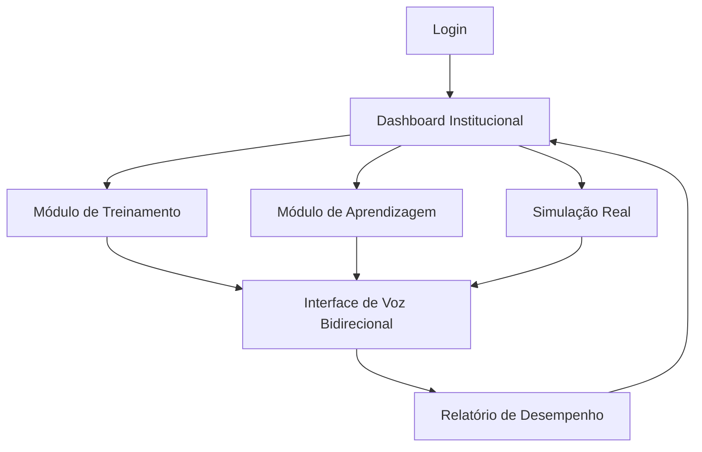

## 1. Visão Geral do Produto

O SGAP-MED Revalida Trainer é uma aplicação web especializada na preparação para a segunda fase do Revalida 2025, seguindo rigorosamente o Edital nº 46 do INEP. O sistema oferece um ambiente de treinamento clínico com interface de voz bidirecional, garantindo precisão institucional e rigor técnico necessário para aprovação no exame.

O produto atende médicos estrangeiros que precisam revalidar seu diploma no Brasil, proporcionando uma experiência de avaliação que replica as condições reais do exame com feedback imediato e personalizado baseado nos padrões do INEP/CFM.

## 2. Funcionalidades Principais

### 2.1 Papéis de Usuário
| Papel | Método de Registro | Permissões Principais |
|-------|-------------------|----------------------|
| Candidato | Registro com CRM provisório | Acesso completo aos módulos de treinamento, aprendizado e simulação |
| Avaliador | Convite institucional | Criação de casos clínicos, análise de desempenho dos candidatos |
| Administrador | Cadastro interno | Gestão de usuários, configuração de parâmetros do edital, relatórios institucionais |

### 2.2 Módulos de Funcionalidades

Nossa aplicação consiste nos seguintes módulos principais:
1. **Dashboard Institucional**: Centralização de parâmetros do edital, progresso do candidato e acesso rápido aos módulos
2. **Módulo de Treinamento**: Diálogo clínico com liberação controlada de achados e sistema PEP hospitalar
3. **Módulo de Aprendizagem**: Tutoria socrática com mnemônicos e fluxogramas baseados em PCDTs do SUS
4. **Simulação Real**: Ambiente de alta pressão com cronômetro de 10 minutos e feedback rigoroso baseado no gabarito INEP

### 2.3 Detalhamento das Páginas

| Nome da Página | Nome do Módulo | Descrição das Funcionalidades |
|----------------|----------------|-------------------------------|
| Dashboard | Painel Institucional | Visualizar parâmetros do edital nº 46, acompanhar progresso de treinamento, acessar três módulos principais com indicadores de conclusão |
| Treinamento | Interface de Diálogo Clínico | Solicitar achados clínicos através de comando de voz, receber respostas estruturadas, visualizar placar PEP em tempo real, registrar hipóteses diagnósticas |
| Aprendizagem | Tutoria Socrática | Interagir com tutores virtuais através de voz, acessar mnemônicos clínicos, estudar fluxogramas de conduta terapêutica, responder perguntas reflexivas sobre diretrizes |
| Simulação | Ambiente de Alta Pressão | Iniciar casos com cronômetro de 10 minutos, interagir com examinador virtual via áudio, receber feedback conciso e rigoroso, visualizar relatório detalhado de acertos/erros |
| Login | Autenticação | Acessar sistema com CRM provisório e senha, recuperar senha via email institucional |
| Perfil | Configurações do Usuário | Atualizar dados pessoais, configurar preferências de áudio, visualizar histórico de simulações |

## 3. Processo Principal

### Fluxo do Candidato
O candidato inicia no Dashboard Institucional onde visualiza seu progresso e os parâmetros do edital. Através do menu principal, acessa os três módulos de capacitação. No Módulo de Treinamento, pratica diálogos clínicos usando comandos de voz para solicitar achados e recebe feedback imediato através de áudio. No Módulo de Aprendizagem, interage com tutores socráticos para consolidar conhecimentos através de perguntas reflexivas. Na Simulação Real, enfrenta casos clínicos completos com cronômetro de 10 minutos, interagindo apenas por voz com o examinador virtual que fornece respostas concisas e rigorosas. Ao final, recebe relatório detalhado comparando seu desempenho com o gabarito esperado pelo INEP.

## 4. Design da Interface do Usuário

### 4.1 Estilo de Design
- **Cores Primárias**: Azul-Marinho Profundo (#1e3a5f) - referência INEP/CFM
- **Cores Secundárias**: Branco-Frio (#f8f9fa) - fundo neutro para foco clínico
- **Botões**: Estilo retangular com bordas sutis, hover em azul mais escuro
- **Tipografia**: Fonte sans-serif institucional (Roboto/Inter), títulos 18-24px, corpo 14-16px
- **Layout**: Card-based com navegação superior, máxima densidade de informações relevantes
- **Ícones**: Minimalistas em outline, sem elementos decorativos que desviem foco cognitivo

### 4.2 Visão Geral das Páginas
| Nome da Página | Módulo | Elementos de UI |
|----------------|--------|-----------------|
| Dashboard | Painel Principal | Cards de métricas em azul-marinho, barras de progresso clínicas, menu lateral compacto, indicadores de conclusão por módulo |
| Treinamento | Interface Clínica | Área de diálogo central com histórico de interações, placar PEP estilo hospitalar, botões de comando de voz destacados, timer discreto |
| Aprendizagem | Tutoria | Painel dividido com tutor virtual (área de áudio), seção de mnemônicos, fluxogramas interativos, perguntas reflexivas em cards |
| Simulação | Alta Pressão | Cronômetro prominente (10:00), interface limpa com mínimas distrações, indicador de fase atual, botão de emergência para pausar |

### 4.3 Responsividade
A aplicação adota abordagem desktop-first, otimizada para uso em notebooks e desktops de alto desempenho. A interface é adaptável para tablets em modo paisagem, mantendo a mesma densidade de informações. A interação por voz é prioritária sobre elementos touch, refletindo as condições reais do exame onde o uso de teclado/mouse é limitado.

### 4.4 Interface de Voz
- **Ativação**: Comando de voz "Preceptor" para iniciar interações
- **Feedback**: Respostas em áudio com voz sintética neutra e clara
- **Indicadores**: Visualização em tempo real do status de gravação/playback
- **Qualidade**: Compressão otimizada para clareza em ambientes hospitalares
- **Acessibilidade**: Transcrição simultânea para referência visual