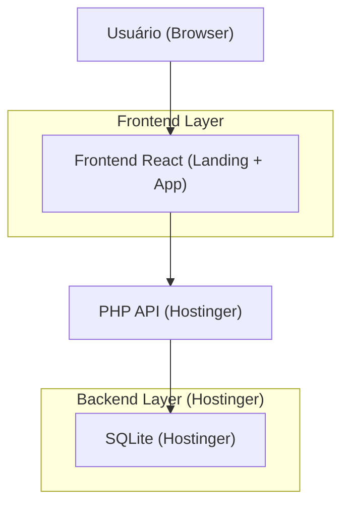
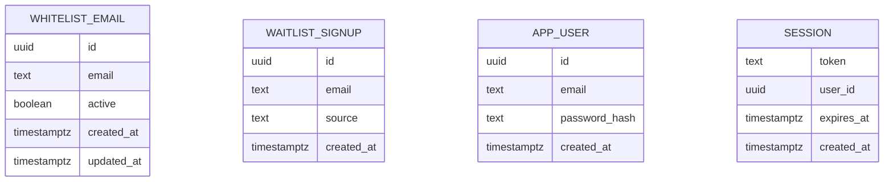

## 1.Architecture design


## 2.Technology Description
- Frontend: React@18 + vite + tailwindcss@3
- Backend: PHP 8.x + SQLite (persistência), hospedado no Hostinger

## 3.Route definitions
| Route | Purpose |
|-------|---------|
| https://SEU_DOMINIO/ | Landing com proposta, preços e checagem de whitelist |
| https://app.SEU_DOMINIO/login | Login/cadastro/recuperação de senha |
| https://app.SEU_DOMINIO/app | Área logada (shell do produto) |

## 6.Data model(if applicable)

### 6.1 Data model definition


### 6.2 Data Definition Language
Whitelist de e-mails (whitelist_emails)
```
-- SQLite (executado automaticamente no primeiro request)
CREATE TABLE IF NOT EXISTS whitelist_emails (
  id TEXT PRIMARY KEY,
  email TEXT UNIQUE NOT NULL,
  active INTEGER NOT NULL DEFAULT 1,
  created_at TEXT NOT NULL,
  updated_at TEXT NOT NULL
);

CREATE TABLE IF NOT EXISTS waitlist_signups (
  id TEXT PRIMARY KEY,
  email TEXT NOT NULL,
  source TEXT NOT NULL DEFAULT 'landing',
  created_at TEXT NOT NULL
);

CREATE TABLE IF NOT EXISTS app_users (
  id TEXT PRIMARY KEY,
  email TEXT UNIQUE NOT NULL,
  password_hash TEXT NOT NULL,
  created_at TEXT NOT NULL
);

CREATE TABLE IF NOT EXISTS sessions (
  token TEXT PRIMARY KEY,
  user_id TEXT NOT NULL,
  expires_at TEXT NOT NULL,
  created_at TEXT NOT NULL
);
```

Notas de segurança (essenciais)
- Checagem de whitelist na landing deve retornar apenas “true/false” (evitar enumeração da lista).
- Cadastro no subdomínio deve falhar se o e-mail não estiver ativo na whitelist.
- Remover credenciais de teste: sem usuários seed, sem “login rápido”, sem strings hard
