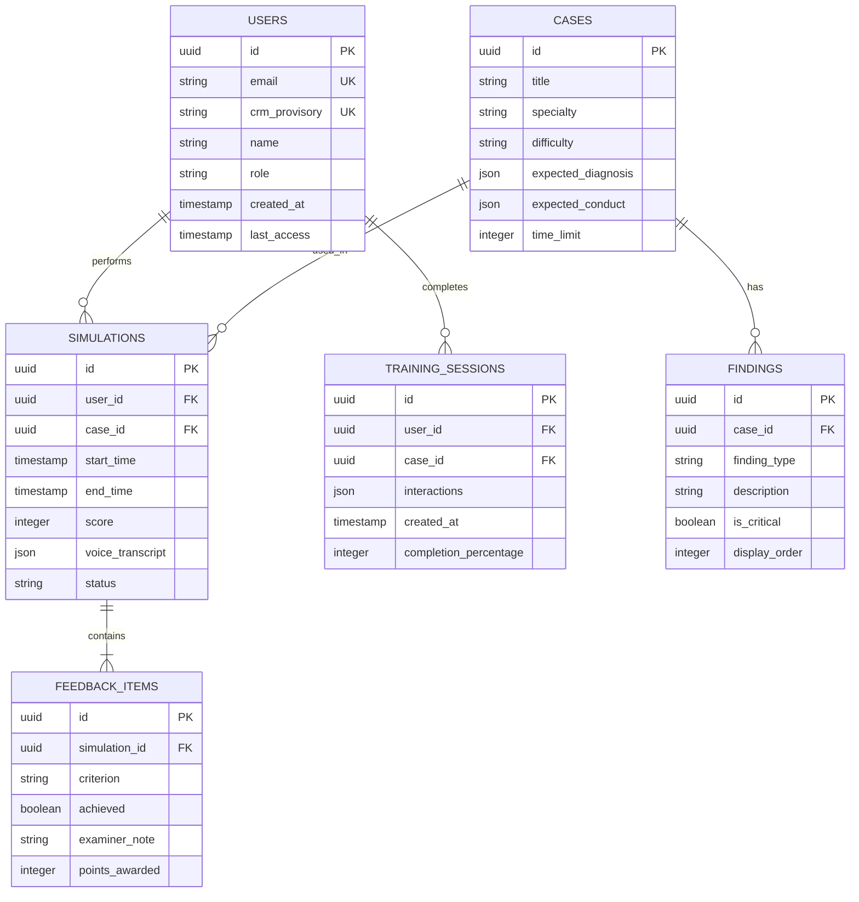

## 1. Arquitetura do Sistema


## 2. Descrição das Tecnologias

- **Frontend**: React@18 + TailwindCSS@3 + Vite
- **Ferramenta de Inicialização**: vite-init
- **Backend**: Supabase (BaaS completo)
- **Processamento de Voz**: Web Speech API nativa do navegador
- **Estado Global**: React Context API + useReducer
- **Roteamento**: React Router DOM@6

## 3. Definições de Rotas

| Rota | Propósito |
|------|-----------|
| / | Login - autenticação de candidatos |
| /dashboard | Dashboard institucional com métricas e acesso aos módulos |
| /treinamento | Módulo de treinamento com interface de diálogo clínico |
| /aprendizagem | Módulo de aprendizagem com tutoria socrática |
| /simulacao | Simulação real com cronômetro de 10 minutos |
| /perfil | Configurações do usuário e histórico de desempenho |
| /relatorio/:id | Visualização detalhada de relatórios de simulação |

## 4. Definições de API

### 4.1 Autenticação
```
POST /auth/v1/token
```

Request:
| Parâmetro | Tipo | Obrigatório | Descrição |
|-----------|------|-------------|-----------|
| email | string | true | CRM provisório do candidato |
| password | string | true | Senha de acesso |

### 4.2 Dados de Simulação
```
GET /rest/v1/simulations
```

Response:
| Campo | Tipo | Descrição |
|-------|------|-----------|
| id | uuid | Identificador único da simulação |
| user_id | uuid | ID do usuário |
| case_id | uuid | ID do caso clínico |
| start_time | timestamp | Início da simulação |
| end_time | timestamp | Término da simulação |
| score | integer | Pontuação obtida |
| feedback | json | Feedback detalhado por critério |

### 4.3 Casos Clínicos
```
GET /rest/v1/cases
```

Response:
| Campo | Tipo | Descrição |
|-------|------|-----------|
| id | uuid | Identificador do caso |
| title | string | Título do caso |
| specialty | string | Especialidade médica |
| difficulty | enum | Nível de dificuldade (basic/intermediate/advanced) |
| expected_findings | json | Achados esperados pelo INEP |
| time_limit | integer | Tempo limite em minutos (10) |

## 5. Arquitetura do Servidor


## 6. Modelo de Dados

### 6.1 Definição do Modelo de Dados


### 6.2 Linguagem de Definição de Dados

Tabela de Usuários (users)
```sql
-- criar tabela
CREATE TABLE users (
    id UUID PRIMARY KEY DEFAULT gen_random_uuid(),
    email VARCHAR(255) UNIQUE NOT NULL,
    crm_provisory VARCHAR(50) UNIQUE NOT NULL,
    name VARCHAR(255) NOT NULL,
    role VARCHAR(20) DEFAULT 'candidate' CHECK (role IN ('candidate', 'examiner', 'admin')),
    password_hash VARCHAR(255) NOT NULL,
    last_access TIMESTAMP WITH TIME ZONE DEFAULT NOW(),
    created_at TIMESTAMP WITH TIME ZONE DEFAULT NOW(),
    updated_at TIMESTAMP WITH TIME ZONE DEFAULT NOW()
);

-- criar índices
CREATE INDEX idx_users_email ON users(email);
CREATE INDEX idx_users_crm ON users(crm_provisory);
CREATE INDEX idx_users_role ON users(role);

-- permissões
GRANT SELECT ON users TO anon;
GRANT ALL PRIVILEGES ON users TO authenticated;
```

Tabela de Simulações (simulations)
```sql
-- criar tabela
CREATE TABLE simulations (
    id UUID PRIMARY KEY DEFAULT gen_random_uuid(),
    user_id UUID REFERENCES users(id) ON DELETE CASCADE,
    case_id UUID REFERENCES cases(id) ON DELETE CASCADE,
    start_time TIMESTAMP WITH TIME ZONE NOT NULL,
    end_time TIMESTAMP WITH TIME ZONE,
    score INTEGER CHECK (score >= 0 AND score <= 100),
    voice_transcript JSONB DEFAULT '[]',
    status VARCHAR(20) DEFAULT 'in_progress' CHECK (status IN ('in_progress', 'completed', 'aborted')),
    created_at TIMESTAMP WITH TIME ZONE DEFAULT NOW()
);

-- criar índices
CREATE INDEX idx_simulations_user_id ON simulations(user_id);
CREATE INDEX idx_simulations_case_id ON simulations(case_id);
CREATE INDEX idx_simulations_status ON simulations(status);
CREATE INDEX idx_simulations_created_at ON simulations(created_at DESC);

-- permissões
GRANT SELECT ON simulations TO anon;
GRANT ALL PRIVILEGES ON simulations TO authenticated;

-- política RLS
CREATE POLICY "Users can view own simulations" ON simulations
    FOR SELECT USING (auth.uid() = user_id);

CREATE POLICY "Users can insert own simulations" ON simulations
    FOR INSERT WITH CHECK (auth.uid() = user_id);
```

Tabela de Casos Clínicos (cases)
```sql
-- criar tabela
CREATE TABLE cases (
    id UUID PRIMARY KEY DEFAULT gen_random_uuid(),
    title VARCHAR(255) NOT NULL,
    specialty VARCHAR(100) NOT NULL,
    difficulty VARCHAR(20) CHECK (difficulty IN ('basic', 'intermediate', 'advanced')),
    expected_diagnosis JSONB NOT NULL,
    expected_conduct JSONB NOT NULL,
    time_limit INTEGER DEFAULT 10 CHECK (time_limit > 0),
    is_active BOOLEAN DEFAULT true,
    created_at TIMESTAMP WITH TIME ZONE DEFAULT NOW()
);

-- criar índices
CREATE INDEX idx_cases_specialty ON cases(specialty);
CREATE INDEX idx_cases_difficulty ON cases(difficulty);
CREATE INDEX idx_cases_active ON cases(is_active);

-- permissões
GRANT SELECT ON cases TO anon;
GRANT ALL PRIVILEGES ON cases TO authenticated;
```

### 6.3 Configuração de Áudio

Para otimização do processamento de voz:
```sql
-- Configurações de áudio por usuário
CREATE TABLE audio_settings (
    id UUID PRIMARY KEY DEFAULT gen_random_uuid(),
    user_id UUID REFERENCES users(id) ON DELETE CASCADE,
    input_device_id VARCHAR(255),
    output_device_id VARCHAR(255),
    speech_rate DECIMAL(3,2) DEFAULT 1.0,
    volume_level INTEGER DEFAULT 80 CHECK (volume_level >= 0 AND volume_level <= 100),
    language VARCHAR(10) DEFAULT 'pt-BR',
    created_at TIMESTAMP WITH TIME ZONE DEFAULT NOW(),
    updated_at TIMESTAMP WITH TIME ZONE DEFAULT NOW()
);

-- Índice único por usuário
CREATE UNIQUE INDEX idx_audio_settings_user_id ON audio_settings(user_id);
```